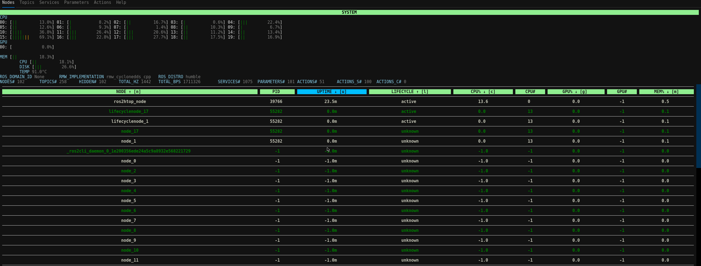

# ros2htop
A real-time terminal monitor for ROS 2, powered by `textual`.

Monitor your ROS2 system at a glance with **nodes, topics, services, parameters, and actions**.




## 👀 What you can see

| Tab | Description | Icon |
|-----|-------------|------|
| **Nodes** | Node stats: lifecycle state, CPU, memory, GPU usage, uptime | 🧠💻 |
| **Topics** | Topic stats: name, type, rate, publishers, subscribers | 📡📈 |
| **Services** | Service names and types | ⚙️🔧 |
| **Parameters** | Parameter name, type, and node | 📝📊 |
| **Actions** | Action servers and clients | 🎯🤖 |


## ⚡ Quick Start

### 1. Install dependencies
```bash
rosdep install --from-paths src --ignore-src -r -y
pip install -r requirements.txt
```

### 2. Build & Source your workspace
```bash
colcon build --packages-select ros2htop_interfaces ros2htop --symlink-install
source install/setup.bash
```

### 3. Run the ros2htop
```bash
ros2 run ros2htop ros2htop_node
```

### 4. Navigate through the tabs
Use the **← / →** arrow keys to switch between tabs. Sort the tables using the keys shown in the **Help** tab.

### 5. Enjoy! 🎉


## 💡 Useful Commands

* Run the tests: `colcon test --packages-select ros2htop --event-handlers console_direct+`
* Run the example scripts (`examples/`) to spin nodes: `python3 examples/lifecyclenode_generator.py` and/or `python3 examples/nodes_generator.py`
* Some of the stats are also published on `/ros2htop_node/stats`